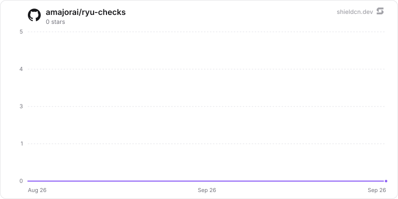

<p align="center">
  <picture>
    <source media="(prefers-color-scheme: dark)" srcset="./icon-dark.png" />
    
  </picture>
</p>

<div align="center">

# Tests

</div>

A local-first verification workspace: configure projects, explore features, generate UI/API check plans, review evidence, group suites, and schedule regression checks inside Ryu.

> **The public home of `ryu-checks`.** Source, builds, and releases live here —
> binaries for every platform are attached to each release.
>
> This tree is generated from the Ryu monorepo, so commits pushed here
> directly are replaced on the next sync. **Pull requests are welcome** —
> open them here and they are ported into the monorepo, then flow back out.
> Ryu as a whole: https://github.com/amajorai/ryu

## Install

**App:** [Install](ryu://apps/@ryu/checks) (opens the Ryu desktop app and asks you to confirm)

**CLI:**

```bash
ryu apps add @ryu/checks
```

## Source & build

This is the **source of record** for the app UI. It imports Ryu's private
`@ryu/ui` design system, so it does **not** build standalone outside the
monorepo — it **builds inside the amajorai/ryu monorepo workspace**.
The shipped bundle is the built artifact, produced by the monorepo build.

## License

Apache-2.0 — see [LICENSE](./LICENSE).

## Surface

- **Home** — project, run, coverage, and failure summaries.
- **All Tests** — persisted projects with UI/API type, coverage, and live-run status.
- **Create Tests** — configure a target, ingest a brief plus extra acceptance/reference
  context or text files, generate/refine cases, explore it, and save a plan with the
  selected Ryu runtime lane.
- **Project detail** — feature exploration, generated Playwright/Python source,
  case-level or project execution, API method/status/assertion controls, retained
  agent runs, evidence-level labels, and failure analysis.
- **Test Lists / Monitoring** — local collections and node-local recurring schedules;
  Run now is available, and each schedule retains its next run and last result.
- **Settings** — runtime capability status and integration boundaries. External OAuth,
  hosted grids, and third-party secrets are not invented inside the app.

Agents and CI adapters can use the manifest's `checks.run_project` and
`checks.analytics` runnable tools through Ryu's authenticated tool registry. They
share the same sidecar state as the Companion rather than creating a second runner.

The installed sidecar also exposes the same contract to automation:

```sh
ryu-checks list
ryu-checks run --project-id <project-id> --trigger ci
ryu-checks analytics
```

`run` prints the retained JSON report and exits non-zero when a case needs
attention, which makes it suitable for a merge gate. `ryu-checks mcp` speaks the
node's standard newline-delimited MCP protocol; its `run_project` and `analytics`
tools are registered by the manifest as `checks.run_project` and
`checks.analytics`.

## Practical parity

The Ryu-owned loop covers the product capabilities that do not require a hosted
vendor account: brief/URL planning, editable cases and generated source,
extra context inputs, feature exploration, deterministic UI/API smoke verification
with method/status/assertion controls, case-level or project runs, an optional Ryu
agent lane with retained transcripts/artifact declarations, bounded evidence and
failure bundles, auto-heal checkpoints, retained history, explicitly assigned
collections, real node-local recurring schedules, coverage analytics, CLI/CI
execution, and MCP/agent access.

Browser screenshots, DOM/video capture, cross-browser and real-device matrices,
OAuth/GitHub authorization, hosted grid workers, and provider-backed data
fixtures remain explicit capability boundaries. They are only reported when a
granted Ryu browser/agent or external CI integration actually returns the
artifact; the live HTTP lane never fabricates those results.

## Evidence boundary

The built-in runner fetches only `http`/`https` targets, caps responses at 2 MiB,
blocks private/link-local destinations except an explicit localhost target, does not
follow redirects, and stores a clipped text preview rather than raw response bodies.
Runs are labelled `live-http`. A screenshot, DOM snapshot, real-device session, or
cloud-grid result is shown only when a granted Ryu agent lane actually supplies it;
the HTTP fallback never presents those as completed artifacts.

## Build

```sh
bun run --cwd apps-store/checks/ui build
bun run --cwd apps-store/checks/ui check-types
bun test --cwd apps-store/checks/ui
cargo test --manifest-path apps-store/checks/backend/Cargo.toml
```

The UI builds to one self-contained `dist/index.html`. In a hosted Companion,
sidecar requests go through the authenticated host bridge. Standalone development
can use the documented local proxy in `vite.config.ts`.

## Star History

<a href="https://github.com/amajorai/ryu-checks/stargazers">
  <picture>
    <source media="(prefers-color-scheme: dark)" srcset="./.github/shieldcn/star-chart-dark.svg" />
    
  </picture>
</a>
